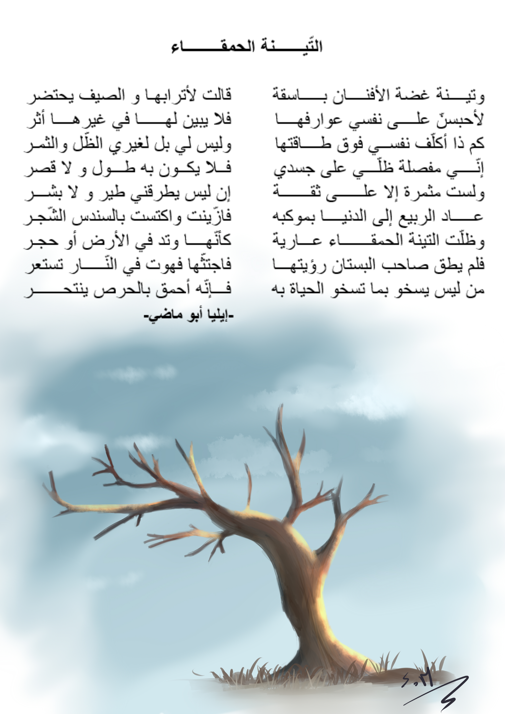

# Poem.js

This project was originaly a script written by [@hamzamez][1] to render Arabic poems correctly in the dom.

## What does this project do?

Provide a lightweight JS library to handle Arabic poems and render them in their Vertical style.

## Why is this project useful?

Believe me! Writing Arabic poems inside your web pages, mobile apps is indeed a frustrating job. Then you have to style it properly to give your readers or users a full experience as they used to with books. This process is very annoying espicially for webmasters who have little experience with HTML or CSS.

## How do I get started?

coming . . . 

## Where can I get more help, if I need it?

coming . . . 

## Contributing

Please read [CONTRIBUTING.md](https://gist.github.com/PurpleBooth/b24679402957c63ec426) for details on our code of conduct, and the process for submitting pull requests to us.

## Versioning

We use [SemVer](http://semver.org/) for versioning. For the versions available, see the [tags on this repository](https://github.com/mohessaid/poem-js/tags). 

## Authors

* **Hamza MEZERREG** - *Initial work* - [hamzamez][1]
* **Mohammed Essaid MEZERREG** - *Renewal & Update* - [mohessaid](https://github.com/mohessaid)

You want to be part of this list :). All pull requests are welcome as long as they
resepect our contributing guidelines.

[1]: https://github.com/hamzamez